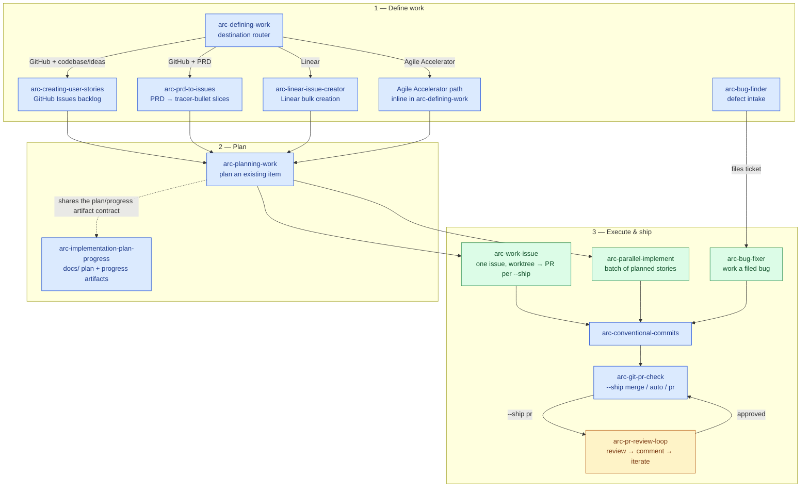

# arc-skills

Portable repository for ARC skills (`arc-*`) so they can be shared and installed on any machine.

## Contents

Each skill lives in its own directory and includes a `SKILL.md` entrypoint. Skills may also include an `evals/evals.json` suite consumable by [`arc-skill-eval`](https://github.com/andysolomon/arc-skill-eval).

## Skill pipeline

How the planning, creation, and execution skills fit together. `arc-defining-work` is the entry-point router when the destination tracker is open; go straight to a specialist when it is already fixed. The canonical story contract (job story + verifiable checklist acceptance criteria + `W-` numbering) lives in [`arc-creating-user-stories/STORY_FORMAT.md`](arc-creating-user-stories/STORY_FORMAT.md).



### Delegation strategy (arc-orchestrator)

Colors mark who does the work when these skills run under [arc-orchestrator](https://github.com/andysolomon/arc-orchestrator):

- **Blue — parent session (judgment & approval).** Defining, planning, routing, review judgment, acceptance, and approval stay in the premium parent session. Under orchestration, implementation and review workers never mutate git or GitHub.
- **Green — delegated implementation.** Inside `arc-work-issue`, `arc-parallel-implement`, and `arc-bug-fixer`, route bounded coding to `composer-implement` (the Cursor/Composer 2.5 implementation lane) by default, or `codex-implement` for difficult fixes and escalation. There is no separate `cursor-implement` route. Orchestrated work is PR-first with `--ship pr` unless the caller explicitly authorizes `--ship auto` or `--ship merge`; standalone skill defaults and ship modes remain unchanged.
- **Amber — premium review.** `arc-pr-review-loop` routes review rounds to a smart model (`opus-review` for taste-sensitive surfaces, `codex-check` otherwise). Review workers return findings to the parent; they do not post them. The parent judges the findings and delegates publication through `mechanical-post-comment`. The loop runs until approval (max 3 rounds), and merge happens only when authorized.

The route map is phase-specific: use `codex-explore` for read-only repository investigation, `composer-implement` for clear mechanical implementation, `codex-implement` for harder implementation, `codex-check` for independent correctness/security/acceptance-criteria review, and `opus-review` for high-taste UI/UX, API, architecture, copy, docs, prompt, or skill critique. When Codex is unavailable, the matching `opus-explore`, `opus-check`, or `opus-implement` route is an availability fallback, not the default. Every write-capable worker gets an isolated worktree; workers return evidence and never commit, push, comment, merge, deploy, edit secrets, or touch unrelated files. After accepting a diff, the parent delegates the conventional commit and push to `mechanical-commit-push`, directly opens the PR with `gh pr create`, delegates GitHub comments to `mechanical-post-comment`, and delegates an explicitly authorized merge or auto-merge to `mechanical-merge`. `arc-git-pr-check` and its full `--ship` behavior remain the standalone path outside orchestration.

Model tiers are routing guidance, not runner route names. **Premier parent/planning:** Fable and Sol. **Smart reasoning/review:** GPT 5.5, Opus, Terra, Grok 4.5, GLM 5.2, and Luna. **Dumb/mechanical:** Composer 2.5, Sonnet 5, Haiku 4.5, Qwen 3 235B, MiniMax M3, Kimi 2.6, 5.4 nano/mini, and Deepseek variants. Prefer the cheapest tier that reliably fits the bounded phase while keeping planning, acceptance, review judgment, and approval with the parent and routing mutations through the required mechanical lanes.

Support skills: `arc-gitlab-glab` (GitLab delivery), `arc-creating-skill` + `arc-creating-evals` (author/maintain skills), `arc-system-design`, `arc-contract-review`, `arc-ideabrowser-openclaw-flow`, `arc-project-deploy-portfolio-sync`, `arc-sf-jwt-bearer`.

## Install (recommended: skills CLI)

This follows the `vercel-labs/skills` README flow.

### List available skills in this repo

```bash
npx skills add andysolomon/arc-skills --list
```

### Install all ARC skills in the current project (cwd)

```bash
npx skills add andysolomon/arc-skills --skill '*'
```

### Install all ARC skills in cwd for Claude Code + Codex only

```bash
npx skills add andysolomon/arc-skills -a claude-code -a codex --skill '*'
```

### Install all ARC skills globally for Claude Code + Codex

```bash
npx skills add andysolomon/arc-skills -g -a claude-code -a codex --skill '*'
```

### Install only specific skills

```bash
npx skills add andysolomon/arc-skills -g -a claude-code -a codex --skill arc-implementation-plan-progress --skill arc-ideabrowser-openclaw-flow
```

### Copy mode (instead of symlinks)

```bash
npx skills add andysolomon/arc-skills -g -a claude-code -a codex --skill '*' --copy
```

## Local installer (fallback)

You can also use the repo script:

```bash
./scripts/install.sh
```

This symlinks all `arc-*` skill folders into:
- `~/.claude/skills`
- `~/.codex/skills`

Use `--copy` to copy instead of symlink:

```bash
./scripts/install.sh --copy
```
