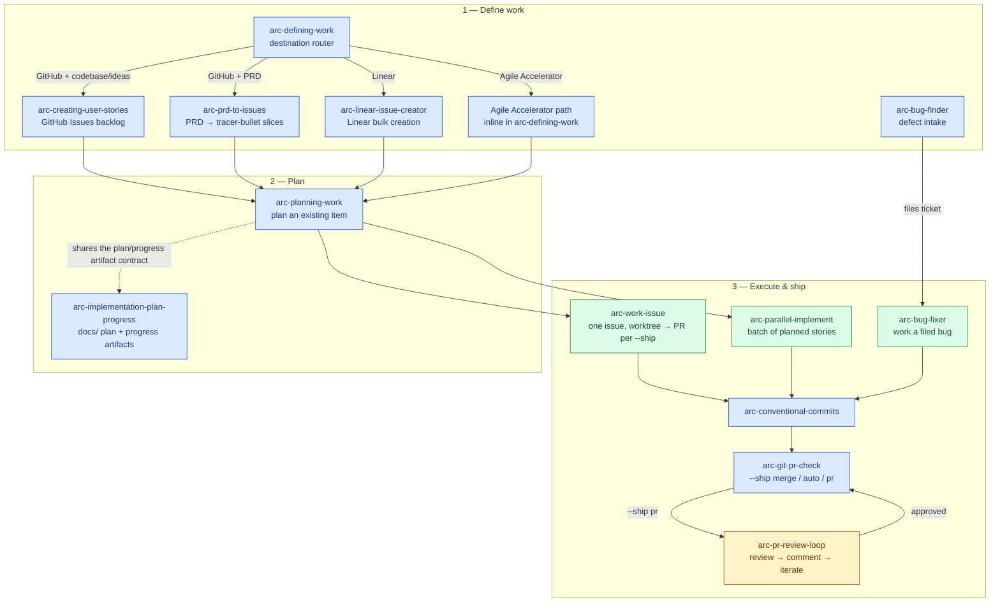

# arc-skills

Portable repository for ARC skills (`arc-*`) so they can be shared and installed on any machine.

## Contents

Each skill lives in its own directory and includes a `SKILL.md` entrypoint. Skills may also include an `evals/evals.json` suite consumable by [`arc-skill-eval`](https://github.com/andysolomon/arc-skill-eval).

## Skill pipeline

How the planning, creation, and execution skills fit together. `arc-defining-work` is the entry-point router when the destination tracker is open; go straight to a specialist when it is already fixed. The canonical story contract (job story + verifiable checklist acceptance criteria + `W-` numbering) lives in [`arc-creating-user-stories/STORY_FORMAT.md`](arc-creating-user-stories/STORY_FORMAT.md).


```mermaid
flowchart TD
    subgraph define [1 — Define work]
        DW[arc-defining-work<br/>destination router]
        CUS[arc-creating-user-stories<br/>GitHub Issues backlog]
        PRD[arc-prd-to-issues<br/>PRD → tracer-bullet slices]
        LIN[arc-linear-issue-creator<br/>Linear bulk creation]
        AA[Agile Accelerator path<br/>inline in arc-defining-work]
        BF[arc-bug-finder<br/>defect intake]
    end

    subgraph plan [2 — Plan]
        PW[arc-planning-work<br/>plan an existing item]
        IPP[arc-implementation-plan-progress<br/>docs/ plan + progress artifacts]
    end

    subgraph execute [3 — Execute & ship]
        WI[arc-work-issue<br/>one issue, worktree → PR per --ship]
        PI[arc-parallel-implement<br/>batch of planned stories]
        BX[arc-bug-fixer<br/>work a filed bug]
        PRL[arc-pr-review-loop<br/>review → comment → iterate]
        CC[arc-conventional-commits]
        PRC[arc-git-pr-check<br/>--ship merge / auto / pr]
    end

    DW -->|GitHub + codebase/ideas| CUS
    DW -->|GitHub + PRD| PRD
    DW -->|Linear| LIN
    DW -->|Agile Accelerator| AA
    BF -->|files ticket| BX

    CUS --> PW
    PRD --> PW
    LIN --> PW
    AA --> PW
    PW -.->|shares the plan/progress artifact contract| IPP

    PW --> WI
    PW --> PI
    WI --> CC --> PRC
    PI --> CC
    BX --> CC
    PRC -->|--ship pr| PRL
    PRL -->|approved| PRC

    classDef parent fill:#dbeafe,stroke:#1d4ed8,color:#1e3a8a;
    classDef worker fill:#dcfce7,stroke:#15803d,color:#14532d;
    classDef premium fill:#fef3c7,stroke:#b45309,color:#78350f;
    class DW,CUS,PRD,LIN,AA,BF,PW,IPP,CC,PRC parent;
    class WI,PI,BX worker;
    class PRL premium;
```

### Delegation strategy (non-Pi arc-orchestrator)

Colors mark who does the work when these skills run under the non-Pi external [arc-orchestrator](https://github.com/andysolomon/arc-orchestrator) path:

- **Blue — parent session (judgment & approval).** Defining, planning, routing, review judgment, acceptance, and approval stay in the premium parent session. Under orchestration, implementation and review workers never mutate git or GitHub.
- **Green — delegated implementation.** On the non-Pi external path, inside `arc-work-issue`, `arc-parallel-implement`, and `arc-bug-fixer`, route bounded coding through an implementation capability advertised by the installed `arc-orchestrator` surface. Do not assume a particular runner alias is installed or is the default. Orchestrated work is PR-first with `--ship pr` unless the caller explicitly authorizes `--ship auto` or `--ship merge`; standalone skill defaults and ship modes remain unchanged.
- **Amber — premium review.** `arc-pr-review-loop` routes review rounds through the review capability advertised by the installed external orchestrator. Review workers return findings to the parent; they do not post them. The parent judges the findings and delegates publication through `mechanical-post-comment`. The loop runs until approval (max 3 rounds), and merge happens only when authorized.

The non-Pi external route map is phase-specific: use the route IDs advertised by the installed `arc-orchestrator` capability surface for repository investigation, implementation, verification, and review. Every write-capable worker gets an isolated worktree; workers return evidence and never commit, push, comment, merge, deploy, edit secrets, or touch unrelated files. After accepting a diff, the parent delegates the conventional commit and push to `mechanical-commit-push`, directly opens the PR with `gh pr create`, delegates GitHub comments to `mechanical-post-comment`, and delegates an explicitly authorized merge or auto-merge to `mechanical-merge`. `arc-git-pr-check` and its full `--ship` behavior remain the standalone path outside orchestration. Any legacy external route alias is external-only and must not be presented as a native Arc Pi route.

### Arc Pi native parallel compatibility

`arc-parallel-implement` selects its runtime by capability: in Arc Pi, use the
native `subagent_spawn` plus `subagent_wait` surface only when both tools are
exposed; otherwise use the non-Pi external `arc-orchestrator` fallback only
when its advertised parallel capability surface is usable. If neither runtime
is usable, stop and report the blocker instead of simulating fan-out. The
native surface is nonblocking, session-scoped, and limited to four active
children. Batch larger sets, record each `arc-sub-...` ID, wait and inspect each
wave, and use `subagent_check`, `subagent_list`, `subagent_cancel`, or the
`/subagents`/`/sub` dashboard for lifecycle control. Native children use a
relative existing cwd inside the current project, so parallel worktrees belong
under `.arc/worktrees/` and that path belongs in clone-local `.git/info/exclude`.

Native children are isolated coding sessions without nested delegation,
extensions, or GitHub/shipping authority. The parent still owns planning,
acceptance, review, commit, PR, merge, and deploy decisions. External runner
aliases are not native Pi routes and must never be passed as a
`subagent_spawn` model value.

Model tiers are routing guidance, not runner route names. **Premier parent/planning:** Fable and Sol. **Smart reasoning/review:** GPT 5.5, Opus, Terra, Grok 4.5, GLM 5.2, and Luna. **Dumb/mechanical:** Composer 2.5, Sonnet 5, Haiku 4.5, Qwen 3 235B, MiniMax M3, Kimi 2.6, 5.4 nano/mini, and Deepseek variants. Prefer the cheapest tier that reliably fits the bounded phase while keeping planning, acceptance, review judgment, and approval with the parent and routing mutations through the required mechanical lanes.

Support skills: `arc-gitlab-glab` (GitLab delivery), `arc-creating-skill` + `arc-creating-evals` (author/maintain skills), `arc-system-design`, `arc-contract-review`, `arc-ideabrowser-openclaw-flow`, `arc-project-deploy-portfolio-sync`, `arc-sf-jwt-bearer`.

### Mode skills

`andrew-mode` sets how work is done: reply shape, autonomy limits, what counts as verified, context hygiene, and prose discipline. It governs behavior only. Every workflow step defers to the arc skill that owns it, so the mode skill never routes work and never ships it.

It is user-invoked (`disable-model-invocation: true`), so it applies only when called by name. Invoke it alongside a pipeline skill rather than instead of one.

## Install (recommended: skills CLI)

This follows the `vercel-labs/skills` README flow.

### List available skills in this repo

```bash
npx skills add andysolomon/arc-skills --list
```

### Install all ARC skills in the current project (cwd)

```bash
npx skills add andysolomon/arc-skills --skill '*'
```

### Install all ARC skills in cwd for Claude Code + Codex only

```bash
npx skills add andysolomon/arc-skills -a claude-code -a codex --skill '*'
```

### Install all ARC skills globally for Claude Code + Codex

```bash
npx skills add andysolomon/arc-skills -g -a claude-code -a codex --skill '*'
```

### Install only specific skills

```bash
npx skills add andysolomon/arc-skills -g -a claude-code -a codex --skill arc-implementation-plan-progress --skill arc-ideabrowser-openclaw-flow
```

### Copy mode (instead of symlinks)

```bash
npx skills add andysolomon/arc-skills -g -a claude-code -a codex --skill '*' --copy
```

## Local installer (fallback)

You can also use the repo script:

```bash
./scripts/install.sh
```

This symlinks all `arc-*` skill folders into:
- `~/.claude/skills`
- `~/.codex/skills`

Use `--copy` to copy instead of symlink:

```bash
./scripts/install.sh --copy
```
